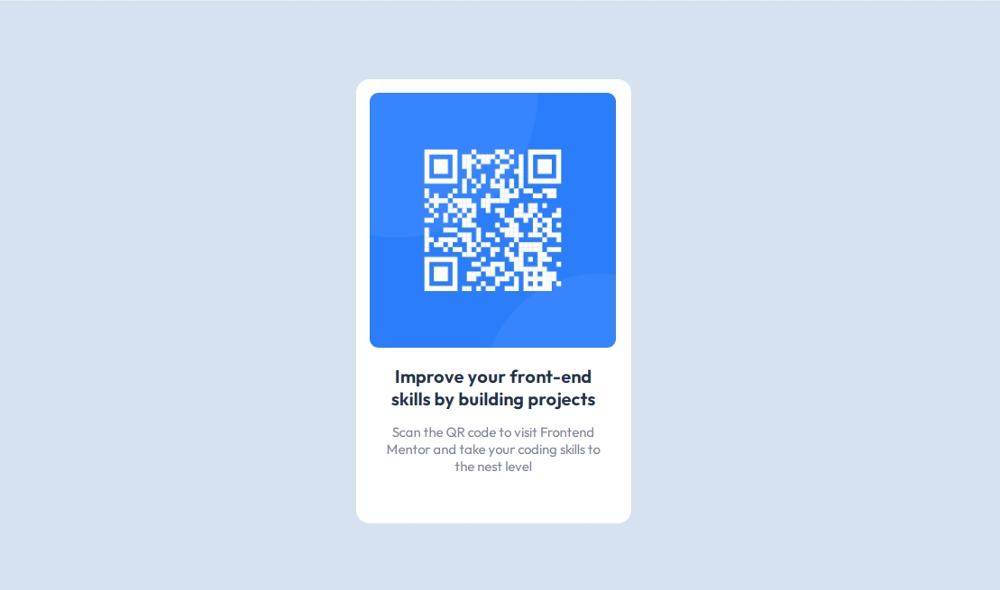

# Frontend Mentor - QR code component solution

This is a solution to the [QR code component challenge on Frontend Mentor](https://www.frontendmentor.io/challenges/qr-code-component-iux_sIO_H). Frontend Mentor challenges help you improve your coding skills by building realistic projects. 

## Table of contents

- [Overview](#overview)
 - [Screenshot](#screenshot)
 - [Links](#links)
 - [Built with](#built-with)
- [Author](#author)

### Screenshot

### Links

- Solution URL: (https://github.com/RivailleAcker/qr-code-component)
- Live Site URL: (https://rivailleacker.github.io/qr-code-component/)

### Built with
- HTML
- CSS custom properties
- Flexbox
- CSS Grid

## Author

- Frontend Mentor - [@RivailleAcker](https://www.frontendmentor.io/profile/yourusername)

